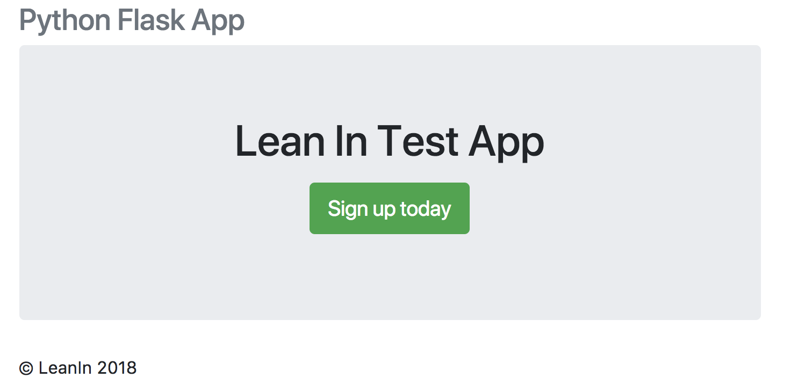

# WebAppDemo

Lean In meeting web application demo.

I've modeled this tutorial from the following link: [Creating a Web App with Python, Flask, and MySQL](https://code.tutsplus.com/tutorials/creating-a-web-app-from-scratch-using-python-flask-and-mysql--cms-22972). Please visit for more details.

## Step 1: Setting Up Flask

Install flash using the `pip` package manager.
```bash
pip install flask
```

Create a file called `app.py` and import that the `flask` module and create a Flask app. Create a home route `/` and a corresponding route handler. Finally at the bottom of the program, check is the executed file `__name__` is the main program `__main__`, then run the flask app. File should display as follows:
```python
from flask import Flask

app = Flask(__name__)

@app.route("/")
def main():
    return "Welcome!"

if __name__ == "__main__":
    app.run()
```

Save and execute the `app.py` file:
```bash
python app.py
```

Go to your browser and navigate to [http://localhost:5000/](http://localhost:5000/) and you should see the welcome message.

## Step 2: Setting Up the Home Page

I've already set up the html files per the structure we discussed in part 1 in the `/templates` directory. The home `/` route usually corresponds to `index.html` file. We now need to import `render_template` from the flask module, which we'll use to render all template files. So instead of returning `"Welcome!"` for our `/` request handler, we can return the rendered `index.html` template.

```python
from flask import Flask, render_template

app = Flask(__name__)

@app.route("/")
def main():
    return render_template('index.html')

if __name__ == "__main__":
    app.run()
```

Save and rerun [http://localhost:5000/](http://localhost:5000/). You should see the following:

