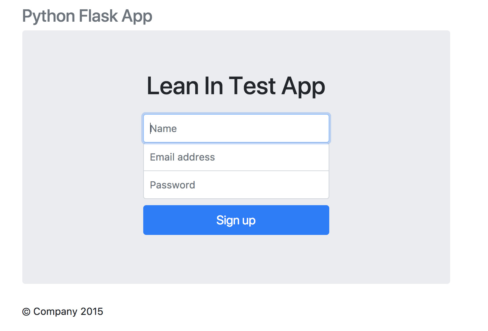

# WebAppDemo

Lean In meeting web application demo.

I've modeled this tutorial from the following link: [Creating a Web App with Python, Flask, and MySQL](https://code.tutsplus.com/tutorials/creating-a-web-app-from-scratch-using-python-flask-and-mysql--cms-22972). Please visit for more details.

## Step 1: Setting Up Flask

Install flash using the `pip` package manager.
```bash
pip install flask
```

Create a file called `app.py` and import that the `flask` module and create a Flask app. Create a home route `/` and a corresponding route handler. Finally at the bottom of the program, check is the executed file `__name__` is the main program `__main__`, then run the flask app. File should display as follows:
```python
from flask import Flask

app = Flask(__name__)

@app.route("/")
def main():
    return "Welcome!"

if __name__ == "__main__":
    app.run()
```

Save and execute the `app.py` file:
```bash
python app.py
```

Go to your browser and navigate to [http://localhost:5000/](http://localhost:5000/) and you should see the welcome message.

## Step 2: Setting Up the Home Page

I've already set up the html files per the structure we discussed in part 1 in the `/templates` directory. The home `/` route usually corresponds to `index.html` file. We now need to import `render_template` from the flask module, which we'll use to render all template files. So instead of returning `"Welcome!"` for our `/` request handler, we can return the rendered `index.html` template.

```python
from flask import Flask, render_template

app = Flask(__name__)

@app.route("/")
def main():
    return render_template('index.html')

if __name__ == "__main__":
    app.run()
```

Save and rerun [http://localhost:5000/](http://localhost:5000/). You should see the following:


## Step 3: Setting Up the Sign Up page

Similar to the home page we want to create sign up page linked to the 'Sign Up' button on the home page. We create a `/showSignUp` route and corresponding request handler that returns the rendered `signup.html` file from `/templates`. We accomplish this through the `href="showSignUp"` in the corresponding `button` html element. This has been done for you. So our `app.py` file should now look like:

```python
from flask import Flask, render_template

app = Flask(__name__)

@app.route("/")
def main():
    return render_template('index.html')

@app.route('/showSignUp')
def showSignUp():
    return render_template('signup.html')

if __name__ == "__main__":
    app.run()
```

Save and rerun [http://localhost:5000/](http://localhost:5000/). You should see the following:



## Step 4: Setting Up the MySQL Database

We'll be using `MySQL` for the back end. So log into MySQL from the command line, or if you prefer a GUI like MySQL work bench that's fine too. Please download and install `mysql`. If you have [HomeBrew](https://brew.sh/) package manager for macOS it's easy:
```bash
brew install mysql
```

After installation, we'll need to create a MySQL database and user as follows: 
1. At the command line, log in to MySQL as the root user:
```bash
mysql -u root -p
```
Type the MySQL root password, and then press Enter. If you do not need a password then simple do:
```bash
mysql -u root
```

2. To create a database user, type the following command. Replace `username` with the user you want to create, and replace `password` with the user's password:
```bash
GRANT ALL PRIVILEGES ON *.* TO 'username'@'localhost' IDENTIFIED BY 'password';
```
We will need this username and password for later in `app.py`.

3. Type `\q` to exit the mysql program.

4. To log in to MySQL as the user you just created, type the following command. Replace username with the name of the user you created in step 3:
```bash
mysql -u username -p
```
Type the user's password, and then press Enter.

5. Now let's create the database:
```SQL
CREATE DATABASE LeanIn;
```

6. To work with the new database, type the following command:
```sql
USE dbname;
```

7. Now let's create a table for our users:
```sql
CREATE TABLE users 
	(	user_id bigint not null auto_increment,
		user_name varchar(45),
		user_username varchar(45),
		user_password varvhar(45),
		primary key (user_id) );
```

8. Now let's see if we created the table:
```sql
show tables;
```

9. Now let's verify the attributes of the user table are correct:
```sql 
desc users
```

Great, now our database is in business.

## Step 5: Implement the Sign Up Method

## Step 6: Create a Sign Up request 

## Step 7: Connecting the Sign Up request to the MySQL Database